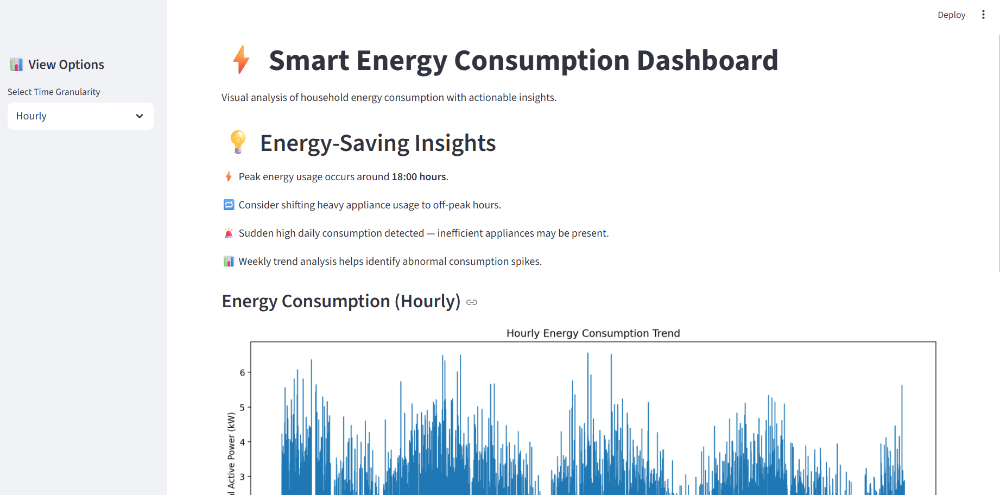
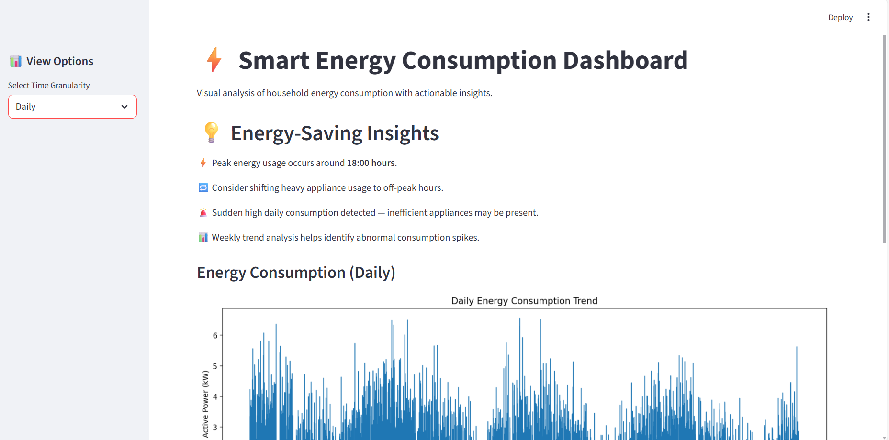
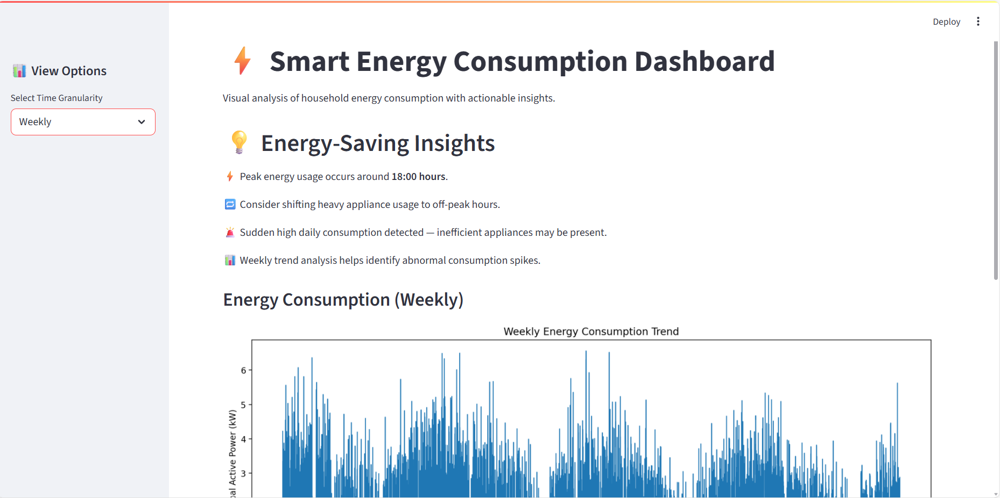

# Smart Energy Consumption Analysis and Prediction using Machine Learning

---

## Project Overview (Understand Before Coding)

This project implements a **Smart Energy Consumption Analysis System** that:

- Understands energy usage patterns over time
- Analyzes historical consumption behavior
- Predicts future energy demand
- Provides actionable energy-saving insights
- Exposes results through a simple web-based dashboard

This is a **full machine learning pipeline project**, not just a model:

**Data → Cleaning → Feature Engineering → Modeling → Evaluation → API → Dashboard → Deployment**

---

## Dataset

**Individual Household Electric Power Consumption Dataset**

- Time-series household energy usage data
- Minute-level measurements
- Includes global power consumption and sub-metering values
- Suitable for temporal and sequence-based modeling

---

## Project Timeline & Milestones

---

### WEEK 1 — Data Understanding & Exploration

**Goal:**  
Understand the dataset deeply before any modeling.

**Key Work:**
- Defined project scope and prediction objective
- Studied dataset structure and column meanings
- Performed exploratory data analysis (EDA)
- Identified missing values and abnormal spikes

**Output:**
- Structured EDA notebook
- Time-series plots
- Written observations and insights

---

### WEEK 2 — Data Cleaning & Preprocessing

**Goal:**  
Convert raw data into clean, model-ready format.

**Key Work:**
- Handled missing timestamps and values
- Outlier detection and treatment
- Time-based resampling (hourly aggregation)
- Feature scaling and normalization
- Time-based train-test split (no shuffling)

**Output:**
- Cleaned dataset
- Reproducible preprocessing pipeline

---

### WEEK 3 — Feature Engineering

**Goal:**  
Create meaningful features that capture energy usage patterns.

**Key Work:**
- Time-based features (hour, weekday, month, weekend)
- Lag features (previous consumption)
- Rolling statistics (moving averages)
- Energy trend representation

**Output:**
- Feature matrix (X)
- Target variable (y)
- Feature explanations and visualizations

---

### WEEK 4 — Baseline Model (Linear Regression)

**Goal:**  
Establish a simple, interpretable baseline.

**Key Work:**
- Implemented Linear Regression
- Trained on engineered features
- Evaluated using MAE and RMSE
- Visualized actual vs predicted consumption

**Output:**
- Baseline model notebook
- Performance metrics
- Benchmark for comparison

---

### WEEK 5 — LSTM Model (Advanced Modeling)

**Goal:**  
Capture temporal dependencies using deep learning.

**Key Work:**
- Sequence generation using sliding windows
- Designed stacked LSTM architecture
- Model training and validation
- Loss curve analysis

**Output:**
- Trained LSTM model
- Training and validation loss plots
- Saved model for inference

---

### WEEK 6 — Model Comparison & Integration

**Goal:**  
Select the best model for production usage.

**Key Work:**
- Compared Linear Regression and LSTM
- Evaluated using MAE, RMSE, and R²
- Selected LSTM as production-ready model
- Prepared model for Flask API integration

**Output:**
- Model comparison results
- Final selected model

---

### WEEK 7 — Dashboard & Insights *(Planned)*

**Goal:**  
Convert model predictions into user-understandable insights.

**Planned Work:**
- Build visual dashboards
- Show hourly, daily, and weekly trends
- Identify peak energy usage periods
- Provide actionable energy-saving suggestions

**Expected Outcome:**
- Clear visual interpretation of consumption behavior
- Insight-driven recommendations

---

### WEEK 8 — Deployment & Final Delivery *(Planned)*

**Goal:**  
Deliver the project like a professional ML engineer.

**Planned Work:**
- Flask backend for model inference
- Frontend integration
- Final testing and validation
- Clean documentation
- Final GitHub submission

---

## Tools & Technologies

- Python
- NumPy, Pandas
- Matplotlib, Seaborn
- Scikit-learn
- TensorFlow / Keras
- Flask (planned)
- Jupyter Notebook

---

## Author

**Kunal Bhardwaj**  
Machine Learning Internship Project
## Milestone 7: Dashboard & Insights
- Built interactive dashboard using Streamlit
- Visualized hourly, daily, weekly energy consumption trends
- Added actionable energy-saving insights based on usage patterns

## Milestone 8: Deployment & Integration
- Developed Flask REST API for energy prediction
- Integrated ML model with backend
- Connected Streamlit dashboard to Flask API
- Tested end-to-end pipeline locally
## How to Run the Project Locally

### 1. Start Backend (Flask)
```bash
cd backend
python app.py
## 📊 Dashboard Preview

### Hourly Energy Consumption


### Daily Energy Consumption


### Weekly Energy Consumption

